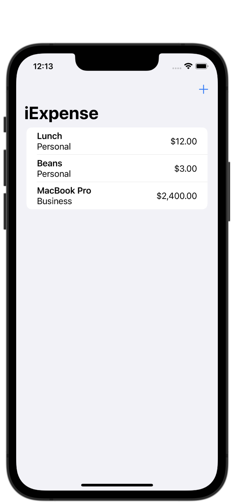
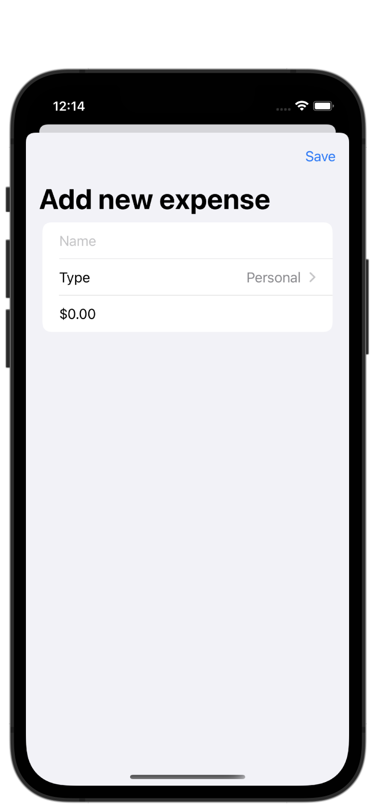
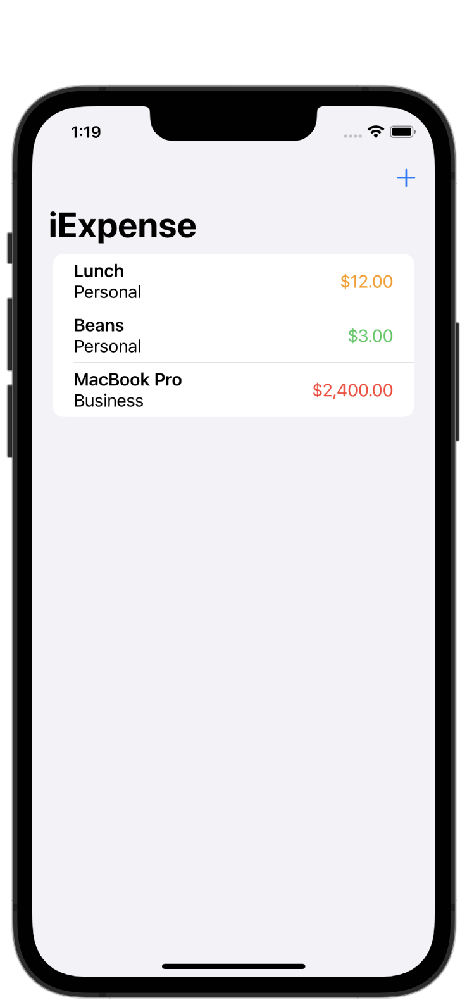

#  Project 7 - iExpense

[Day 36 - iExpense Part One](https://www.hackingwithswift.com/100/swiftui/36)

[Day 37 - iExpense Part Two](https://www.hackingwithswift.com/100/swiftui/37)

[Day 38 - iExpense Part Three](https://www.hackingwithswift.com/100/swiftui/38)

## Topics

* UserDefaults
* Codable
* sheet()
* onDelete()
* @StateObject, @ObservedObject, @Environment

## Challenges

1. Use the user’s preferred currency, rather than always using US dollars.
2. Modify the expense amounts in ContentView to contain some styling depending on their value – expenses under $10 should have one style, expenses under $100 another, and expenses over $100 a third style. What those styles are depend on you.
3. For a bigger challenge, try splitting the expenses list into two sections: one for personal expenses, and one for business expenses. This is tricky for a few reasons, not least because it means being careful about how items are deleted!

## Screenshots

### Base app

    
    

### Challenges

    

